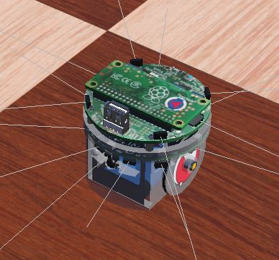

# Pi_Puck-ROS2-Code-Examples
This repository is intended for educational use. 
Containing information of Pi-Puck simulation and ROS2 examples.
## Introduction
The Pi-puck is a [Raspberry Pi](https://www.raspberrypi.org) extension board for the [e-puck](http://www.gctronic.com/doc/index.php?title=E-Puck) and [e-puck2](http://www.gctronic.com/doc/index.php?title=e-puck2) robot platforms, designed and built as a collaboration between the [University of York](https://www.york.ac.uk/robot-lab/) and [GCtronic](http://www.gctronic.com).

[Webots](https://cyberbotics.com/) is an open source, professional mobile robot simulation software package. It can be used for a variety of applications.
I used it for rapid prototyping and carrying out swarm experiments.

This repository is a set of code examples and useful links to other ROS2 code.

For more information about the Pi-puck and Webots, see:
- GCtronic wiki page - http://www.gctronic.com/doc/index.php?title=Pi-puck
- Pi-puck on the YRL website - https://www.york.ac.uk/robot-lab/pi-puck/
- IROS 2017 paper - https://eprints.whiterose.ac.uk/120310/
- ANTS 2020 paper-https://eprints.whiterose.ac.uk/170703/1/ANTS_2020_Pi_puck_paper.pdf
- Webots ROS2 GitHub - https://github.com/cyberbotics/webots_ros2
- Webots documentation - https://cyberbotics.com/doc/guide/index
- Webots paper - https://link.springer.com/chapter/10.1007/978-3-540-78317-6_23



The sections go as follows:
- Webots
- ROS2
  - Frontier detection
  - Path finding
  - Data collection
- Links to good tutorial and code bases
## Webots
Webots has support for the [epuck2](https://www.gctronic.com/doc/index.php/e-puck2) robot however, this includes support for the Pi-Puck.
This is an early version of the Pi-Puck so a few modifications had to be made. 

I had to add the extra time of flight sensors (tof). I defined a proto file then added them into the [Webots_Ros2_Epuck Driver](https://github.com/lucas-d87u/Pi_Puck-ROS2-Code-Examples/blob/main/Webots-Modifications/driver.py). I also enabled the full use of the [IMU](https://en.wikipedia.org/wiki/Inertial_measurement_unit) sensor. This is done automatically by Webots when the component is added by the [Device Manager](https://github.com/cyberbotics/webots_ros2/blob/3a91326c3df2597a1a217d82ab1a60cdd7ce976b/webots_ros2_core/webots_ros2_core/devices/device_manager.py#L31).

The last change I made was to the launch files. In the [webots_ros2_core](https://github.com/cyberbotics/webots_ros2/tree/3a91326c3df2597a1a217d82ab1a60cdd7ce976b/webots_ros2_core/launch) file there is [robot_launch.py](https://github.com/cyberbotics/webots_ros2/blob/3a91326c3df2597a1a217d82ab1a60cdd7ce976b/webots_ros2_core/launch/robot_launch.py) I have replaced this with [robot_launch_multi.py](https://github.com/lucas-d87u/Pi_Puck-ROS2-Code-Examples/blob/main/Webots-Modifications/launch-files/robot_launch_multi.py) and this can be found in this repository. I have also ammended the corresponding launch file in [webots_ros2_epuck](https://github.com/cyberbotics/webots_ros2/tree/3a91326c3df2597a1a217d82ab1a60cdd7ce976b/webots_ros2_epuck) calling it [robot_multi_launch.py](Examples/blob/main/Webots-Modifications/launch-files/robot_multi_launch.py). 

These are effectively the same except I added a for loop to append more controllers. These have to be set manually, though it should be simple to add a paramter to control this.

Assuming you have set up a ROS2 [work space](https://docs.ros.org/en/foxy/Tutorials/Workspace/Creating-A-Workspace.html) and set up the [Webots ROS2 package](https://github.com/cyberbotics/webots_ros2). You should be able to (after replacing or adding these files) to call the launch file like this.

```
cd to your work space
source /opt/ros/foxy/setup.bash
. install/setup.bash
ros2 launch webots_ros2_epuck robot_multi_launch.py
```
This will launch the Pi-Puck in a maze world. I have also added the world and driver for the Pi-Puck with multiple small lidars.

## ROS2
## Frontier detection
## Path finding
## Data Collection

## Links to good tutorial and code bases

- [Occupancy Grid Mapping with Webots and ROS2](https://towardsdatascience.com/occupancy-grid-mapping-with-webots-and-ros2-a6162a644fab)
- [https://automaticaddison.com/](https://automaticaddison.com/) This whole website is very useful
- [ROS2 cookbook](https://github.com/mikeferguson/ros2_cookbook)
- [Basic video series about ROS2](https://www.reddit.com/r/ROS/comments/jipc4v/webots_ros2_tutorial_series/)
- [Colcon build cheat sheet](https://github.com/ubuntu-robotics/ros2_cheats_sheet)
